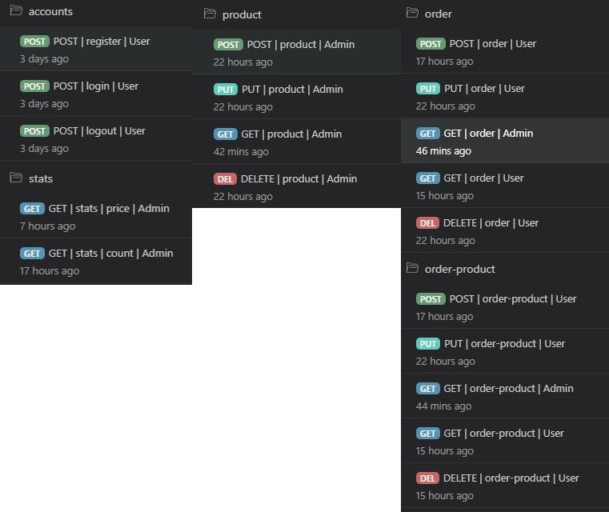
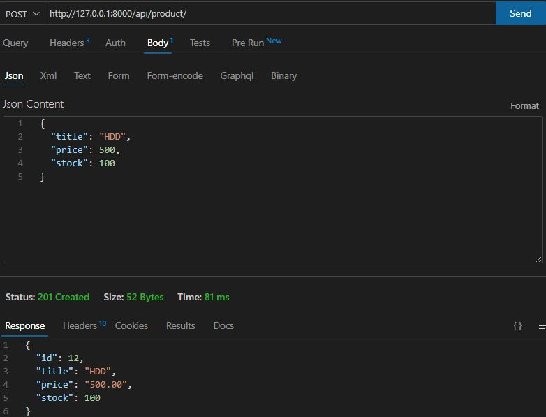
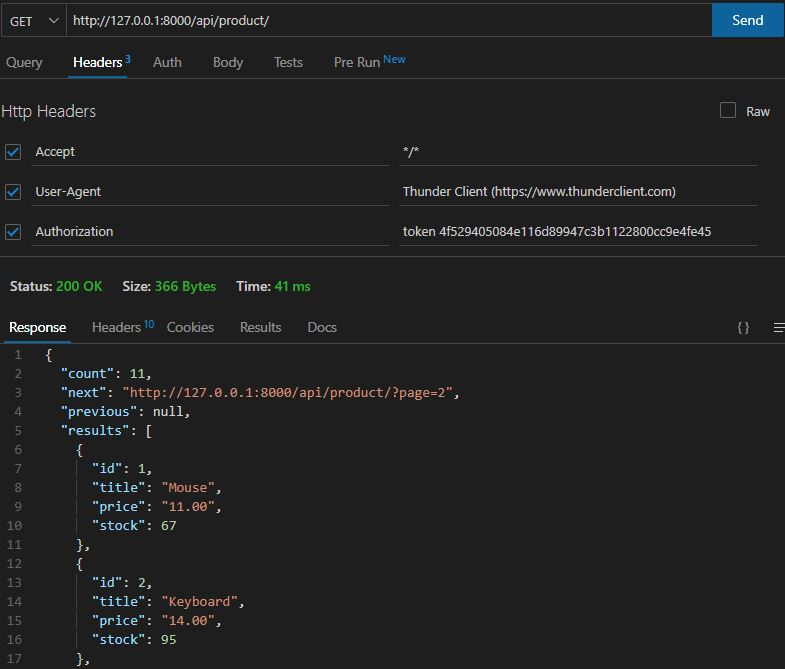
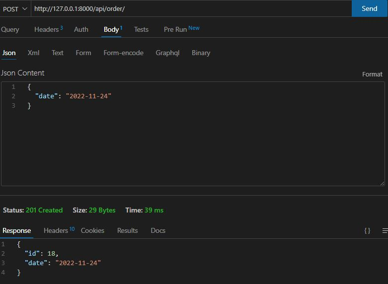
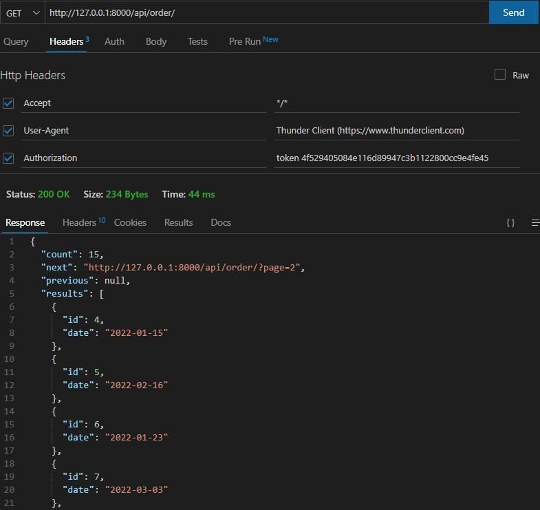
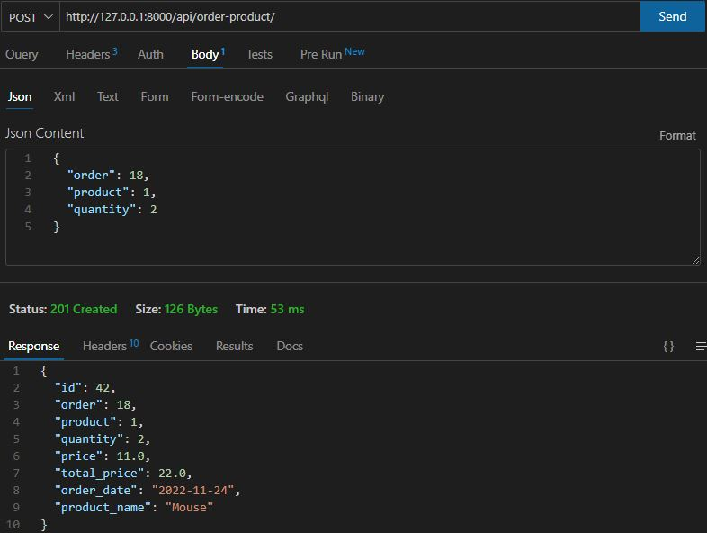
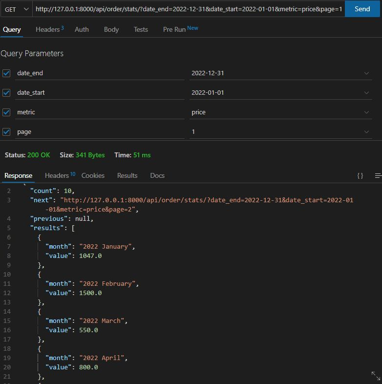
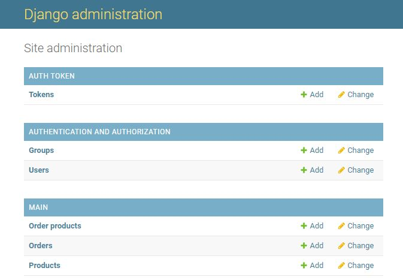
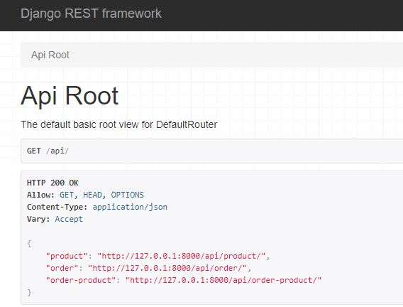

# Online Store API

## Installation

#### Install Python 3:

- Please checkout https://realpython.com/installing-python/

#### Create virtual environment:

- Go to you project directory, then

```shell
> py -3 -m venv .venv
```

```shell
> .\.venv\Scripts\Activate.ps1
```

#### Install requirements:

```shell
> pip install -r requirements.txt
```

#### Loading fixtures:

```shell
> python manage.py loaddata additional_materials/fixtures/dump.json
```
- [Online Store API fixtures](https://github.com/YordanPetrovDS/OnlineStoreAPI/tree/main/additional_materials/fixtures)

## Running API Server

```shell
> python manage.py runserver
```

## Thunder Client Collection



- [Online Store API Collection](https://github.com/YordanPetrovDS/OnlineStoreAPI/tree/main/additional_materials/thunder_client)

## Sample Screenshots

- POST | Product
  
- PUT | Product
  
- GET | Product
  
- POST | Order
  
- GET | Order
  
- POST | Order Product
  
- GET | Stats
  

## Admin Panel

- http://127.0.0.1:8000/admin

Basic CRUD operations can also be done from the admin interface of Django and Django Rest Framework.



- http://127.0.0.1:8000/api/auth/accounts/register/
- http://127.0.0.1:8000/api/auth/accounts/login/
- http://127.0.0.1:8000/api/auth/accounts/logout/
- http://127.0.0.1:8000/api/product/
- http://127.0.0.1:8000/api/order/
- http://127.0.0.1:8000/api/order/stats/
- http://127.0.0.1:8000/api/order-product/


